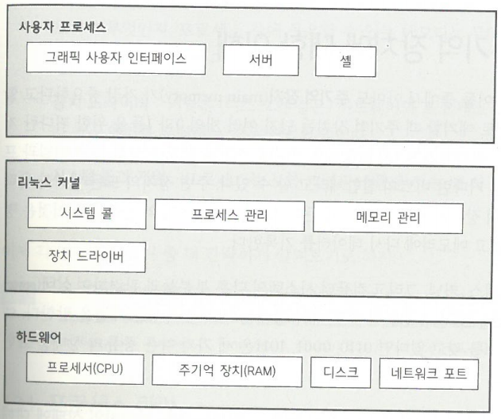

# 리눅스 작동법

---
## 목차 

[1장. 조감도](#1장.-조감도)

2장. 기본 명령어와 디렉터리 계층 구조

3장. 디바이스

4장. 디스크와 파일 시스템

5장. 리눅스 커널 부팅 방법

6장. 사용자 공간 시동 방법

7장. 시스템 설정: 로깅, 시스템 시간, 일괄 작업과 사용자

8장. 프로세스와 리소스 활용

9장. 네트워크와 그 설정에 대한 이해

10장. 네트워크 응용프로그램과 서비스

11장. 셸 스크립트 소개

12장. 네트워크를 거쳐 파일 옮기기

13장. 사용자 환경

14장. 리눅스 데스크톱에 대한 조망

15장. 개발 툴

16장. C 소스 코드로 소프트웨어 컴파일하는 기본적인 방법

17장. 기초를 바탕으로 길제 구축하기

---
## 1장. 조감도

- 운영체제가 동작하는 방법을 추상(abstraction)으로 이해하자
    - 추상? 대부분의 상세 부분을 무시하는 것

### 1.1 리눅스 시스템의 추상화 레벨과 레이어

- 레이어(layer) or 레벨(level)
    - 해당 구성요소가 사용자와 하드웨어 사이의 어디에 위치하는지에 따라 구성요소를 구분(그룹으로 분류)하는 것

- 리눅스 시스템 세가지 주요 레벨
    

- 커널과 사용자 프로세스 동작 방식 차이점
    - 커널 
        - 커널 모드(kernel mode)에서 동작
        - 프로세서나 주기억 장치에 제한 없이 접근 가능
        - 커널 공간(kernal space)
            - 커널만 접근 가능한 영역
    - 사용자 프로세스
        - 사용자 모드(user mode)에서 동작
        - (아주 적은) 메모리 공간의 일부와 안전한 CPU작업에만 접근할수 있도록 제한됨
        - 사용자 공간
            - 사용자 프로세스가 접근할 수 있는 주기억 공간의 일부
        - 만약 프로세스가 실수하더라도 결과가 제한적이고 커널에서 해결 가능

### 1.2 하드웨어: 주기억 장치에 대한 이해

- 주기억 장치(main memory)
    - 0과 1(비트)들을 위한 커다란 저장 공간(집합체)
    - 실행 중인 커널과 프로세스가 상주하는 공간
    - 주변 장치의 모든 입출력이 비트 묶음의 형태로 주기억 장치로 흘러들어가게 됨

- CPU
    - 메모리상의 운영자
    - 명령들과 메모리의 데이터를 읽고 메모리에 다시 데이터를 기록

- 상태(state)
    - 비트의 특정한 배열
        - 예시) 메모리에 4비트 -> 0110,0001,1011 세가지 다른 종류의 상태를 표현함
    - 상태에 대해 추상적 용어를 사용
        - 단 하나의 프로세스가 메모리에서 수백만의 비트로 구성되기 때문에 비트로 표현하기 어려움

### 1.3 커널

- 커널이 실행하는 거의 모든 작업은 주기억 장치를 위주로 진행
- 커널은 메모리를 여러 개의 구획으로 분리하고, 구획에 대한 상태 정보를 항상 보유해야함
- 각 프로세스는 메모리에 각자의 구획을 갖고, 커널은 각 프로세스가 각각의 구획을 유지를 하는지 확인

- 커널의 유지 책임(아래 네가지 일반 시스템 영역내 작업 유지)
    - 프로세스 
        - 커널은 어떤 프로세스가 CPU의 사용을 허용받았는지 알고 있어야 함 
    - 메모리 
        - 커널은 모든 메모리를 지속적으로 파악해야함
            - 현재 특정 프로세스에 할당된 메모리가 무엇인지
            - 프로세스 간 공유할 수 있는 메모리는 무엇인지
            - 할당되지 않은 것은 무엇인지
    - 장치 드라이버
        - 커널은 (디스크와 같은) 하드웨어와 프로세스 사이의 인터페이스로 동작
        - 하드웨어를 운영하는 것은 커널의 일
    - 시스템 콜과 지원
        - 프로세스는 보통 커널과 소통을 하는데 시스템 콜(system call)을 사용

